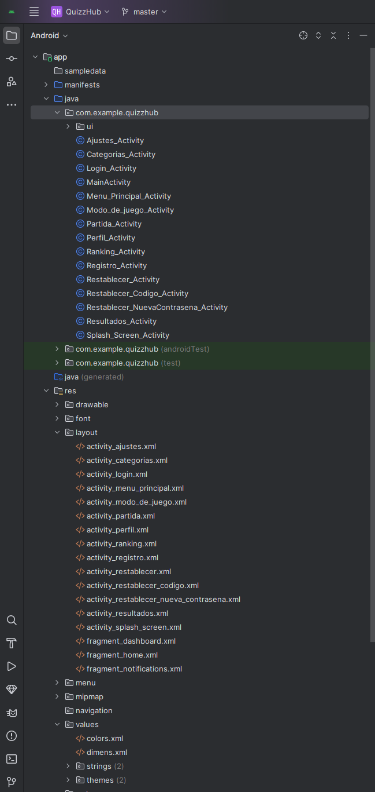

# QuizzHub


**QuizzHub** es una aplicación de tipo quiz para Android que permite a los usuarios participar en juegos de preguntas y respuestas. El proyecto está diseñado para ofrecer un sistema de preguntas dinámicas, soporte para multijugador en tiempo real, integración con Firebase y un sistema de puntuaciones y rankings.


> ⚠️ **Atención**: Este proyecto está en desarrollo y algunas funcionalidades aún pueden no estar completamente implementadas.

## Funcionalidades

- **Sistema de preguntas y respuestas**: Los usuarios pueden seleccionar categorías y responder preguntas con un temporizador para cada pregunta.
- **Modo multijugador**: Los jugadores pueden unirse a salas de juego y competir en tiempo real con otros usuarios.
- **Almacenamiento en Firebase**: Las preguntas y las puntuaciones se guardan de manera persistente en Firebase.
- **Análisis con Firebase Analytics**: Se registran eventos para medir la interacción de los usuarios con la aplicación.
- **Interfaz intuitiva**: La interfaz está diseñada para ser fácil de usar, con un enfoque en la experiencia del usuario.

## Requisitos y tecnologías usadas

- **Android Studio**: Usado para desarrollar la aplicación.

- **Java**: Lenguaje de programación utilizado.

- **Firebase**: Usado para autenticación, almacenamiento y análisis.

## Instalación

### Requisitos previos

- Tener **Android Studio** instalado.
- Tener una cuenta en **Firebase** para integrar los servicios de autenticación y base de datos.

### Pasos para la Instalación

1.  Clona el repositorio
   ```sh
   git clone https://github.com/P4vila/QuizzHub
   ```


### Vista general de Proyecto una vez clonado 
- Una vez clonado el repositorio a Android Studio tendrás una visión parecida a esta
- 

## Funcionalidades

**QuizHub** es una aplicación interactiva de quiz que ofrece una experiencia de juego dinámica y divertida. A continuación, se detallan las principales funcionalidades de la aplicación:

<details>
  <summary><strong>1. Sistema de Preguntas y Respuestas</strong></summary>
  <ul>
    <li>Los usuarios pueden seleccionar categorías de preguntas y responderlas en tiempo real.</li>
    <li>Las preguntas tienen múltiples opciones de respuesta, con solo una correcta.</li>
    <li>Cada pregunta tiene un límite de tiempo para ser respondida.</li>
  </ul>
</details>

<details>
  <summary><strong>2. Sistema de Puntuación</strong></summary>
  <ul>
    <li>Registra el rendimiento del jugador durante la partida o partida en sala</li>
    <li>Las puntuaciones se acumulan al final de cada sesión de juego.</li>
  </ul>
</details>

<details>
  <summary><strong>3. Modo Multijugador</strong></summary>
  <ul>
    <li>Los jugadores pueden unirse a salas de juego en línea para competir contra otros.</li>
    <li>Sistema de turnos, donde cada jugador responde a preguntas en su turno.</li>
    <li>Ranking en tiempo real que muestra las puntuaciones de los jugadores en la sala.</li>
  </ul>
</details>

<details>
  <summary><strong>4. Registro de Usuarios</strong></summary>
  <ul>
    <li>Los usuarios pueden registrarse mediante correo electrónico y contraseña a través de Firebase Authentication.</li>
    <li>Recuperación de contraseña disponible si el usuario olvida sus credenciales.</li>
  </ul>
</details>

<details>
  <summary><strong>5. Persistencia de Datos</strong></summary>
  <ul>
    <li>Las preguntas y respuestas se almacenan en **Firebase Firestore**, permitiendo actualizaciones dinámicas y persistencia de datos en tiempo real.</li>
    <li>Se guarda el historial de puntuaciones y progreso de los usuarios en Firebase.</li>
  </ul>
</details>

<details>
  <summary><strong>6. Análisis de Uso</strong></summary>
  <ul>
    <li>Se registran eventos y comportamientos de los usuarios mediante **Firebase Analytics**.</li>
    <li>Los datos recopilados ayudan a optimizar la experiencia del usuario y entender mejor cómo se usa la aplicación.</li>
  </ul>
</details>

<details>
  <summary><strong>7. Interfaz Intuitiva</strong></summary>
  <ul>
    <li>Diseño optimizado para una experiencia de usuario fluida y fácil de usar.</li>
    <li>Compatible con dispositivos Android y adaptada a pantallas de diferentes tamaños.</li>
  </ul>
</details>

<details>
  <summary><strong>8. Seguridad</strong></summary>
  <ul>
    <li>Gestión segura de datos, como contraseñas y correos electrónicos, mediante Firebase Authentication.</li>
    <li>Transmisión segura de datos de preguntas y respuestas entre el servidor y el cliente.</li>
  </ul>
</details>

**¡Disfruta jugando y aprende mientras te diviertes con QuizHub!**

# Frames De la Aplicación 
## Extraidas de Figma


# Links de Interés Sobre el diseño UX UI

## Prototype Link Figma :
https://www.figma.com/proto/5OBxAH1LMzsUZXMoY3apKI/QuizzHub?node-id=0-1&t=3DWjGyoYEc5khzsL-1


## Behance IU UX Design :
https://www.behance.net/gallery/219161333/Quizzhub-App-UIUX


<!-- LICENSE -->
## Licencia

Dsitribuido bajo la licensia de proyecto MIT. Leer `LICENSE.txt` para mas información.

<!-- CONTACT -->
## Contacto

José Manuel Piñero - jpa0023@alu.medac.es

Luciana Perez - lpm0025@alu.medac.es

Project Link: https://github.com/P4vila/QuizzHub

